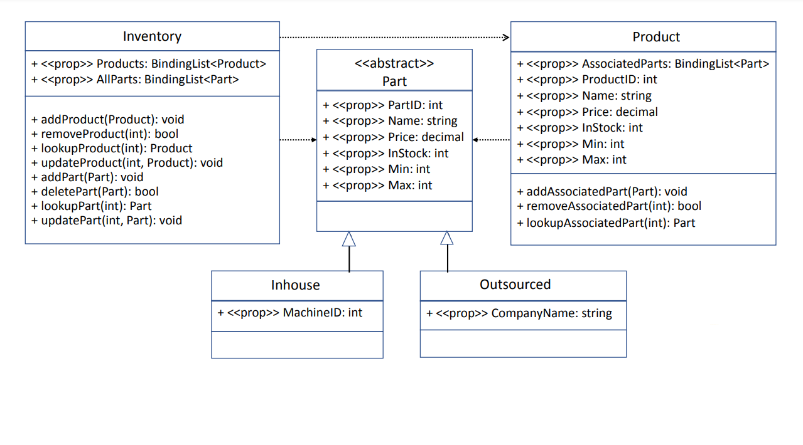
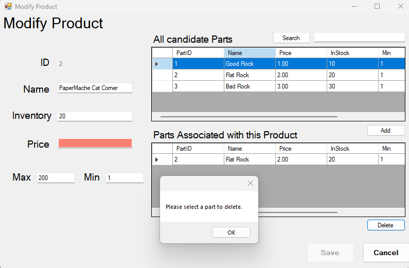
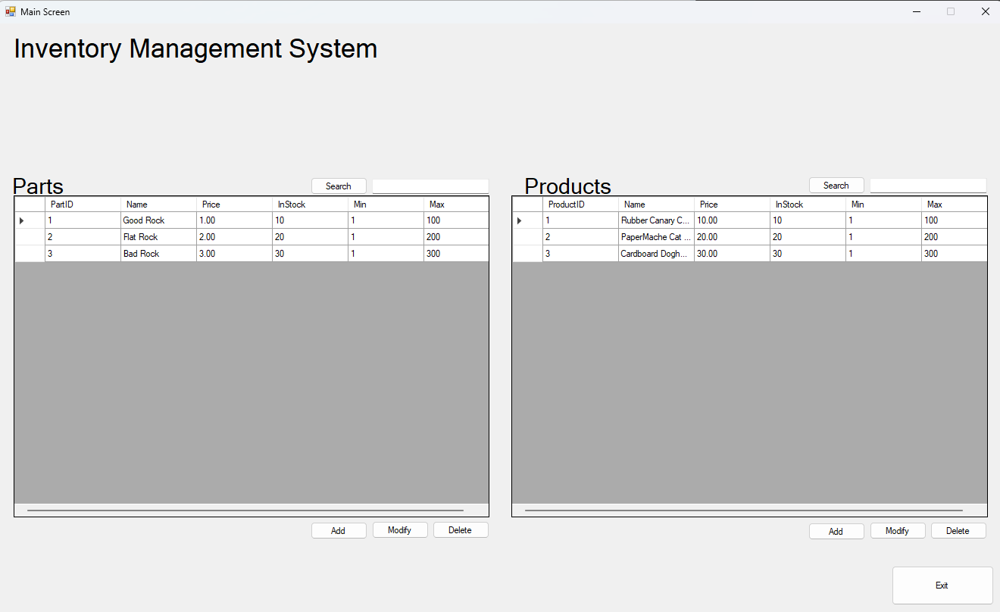

# Inventory Management Application

#### Winforms C#.NET application, based on provided business requirements and GUI Mock-up

_Object-Oriented Application Development in C# C968 WGU_

- Classes, methods, and properties implement the following:

  

- Main form allows the user to add, modify, delete, and search for parts and products
- Add/Modify Part form allows users to add new or modify existing parts
- Add/Modify Product form allows users to add new or modify existing products and associate parts with products
- Validation for user input fields

